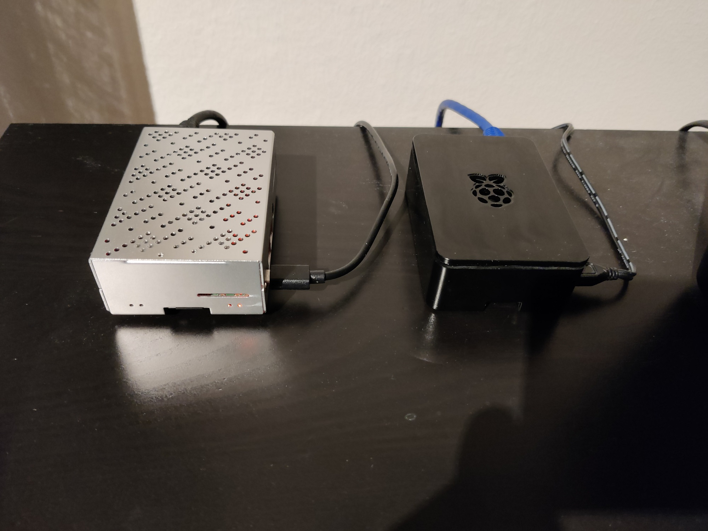

# Ansible K8s bootstrapping for multinode cluster

These plays are defined for clean Ubuntu server 20.04 LTS vanilla installations.

## Hardware

* Master node: Raspberry Pi 4 4GB  
* Worker node: Raspberry Pi 3B+ 1GB




## SSH setup

Run the following commands to configure public key authentication for the nodes.

### Adding authorized key to remote
```bash
ssh-keygen -t ed25519 -C "admin"
ssh-copy-id -i ~/.ssh/admin.pub <host_address>
````

### SSH config file

Can be used once the base configuration is complete.

**~/.ssh/config**
```bash
Host master01
        Hostname <host_address>
        User k8s
        IdentityFile ~/.ssh/admin
        PreferredAuthentications publickey
Host worker01
        Hostname <host_address>
        User k8s
        IdentityFile ~/.ssh/admin
        PreferredAuthentications publickey
```

## Test connection

`ansible all -m ping`


## Run the base config

Optional: Dry run with `--check --diff` to see what will change.

Note: In subsequent runs the ubuntu user is disabled and the hostnames are changed.

`ansible-playbook base_config.yaml --diff -u ubuntu --ask-vault-pass -e @secrets.yaml`

## Vault management

1. Create a file secrets.yaml


**secrets.yaml**
```yaml
---
k8s_admin_password: "<your password>"
```

2. (Optional): Create a vault.pass file to store the vault password.
3. (Optional): Encrypt with `ansible-vault encrypt secrets.yaml`


### Viewing secrets

`ansible-vault view secrets.yaml`


## Bootstrap & configure cluster

Use k8s user with sudo for bootstrapping.

`ansible-playbook bootstrap.yaml --check --diff -u k8s -K`